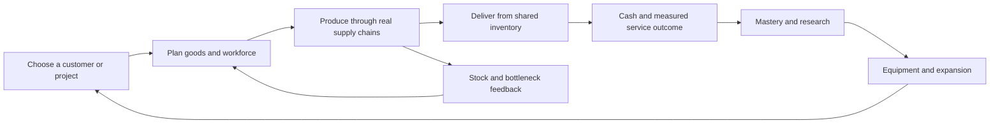

# Connected game implementation plan

**Set aside by the user.** The current system roles are recorded in [SYSTEM_ROLES.md](SYSTEM_ROLES.md). This earlier proposal is retained as discussion history and must not be treated as the active implementation direction.

13 September 2026. Proposed implementation sequence; this document does not change gameplay.

## Product direction

**Build a town that can reliably handle increasingly demanding business opportunities.** Players choose customers, allocate their existing workforce and goods, operate real supply chains, earn capability through successful service, and invest in the next challenge.

The game is persistent. Players visit whenever they want. Production and prearranged shipments can work while they are away, subject to the existing offline allowance. There is no assumed classroom play duration.

This plan builds on the current permanent workforce, production engine, real inventory, customer board, research, equipment and game pages. It reconnects town mechanics through shared resources and outcomes. The investment licence becomes a capstone that introduces the separate practice portfolio clearly.

## Established mechanics and how they apply

These are documented mechanics and developer rationales from established games. Their successful use elsewhere supports the design direction; the exact YoMama rates and difficulty still require simulation and player observation.

| Reference | Documented pattern | Application here |
| --- | --- | --- |
| [Factorio: Research and Technology](https://factorio.com/blog/post/fff-376) | Technology can unlock after actual mining, crafting or launching. This keeps research connected to capabilities the factory has used. | Business achievements observe real production and shipments. Recipe unlocks precede challenges that require those recipes. |
| [Anno 1800: Working Conditions](https://www.anno-union.com/devblog-working-conditions/) | Limited workforce affects production; earlier workforce remains useful in later chains. | Reuse the existing finite workforce roster and preserve the importance of earlier suppliers. |
| [Anno 1800: Pushing Carts](https://www.anno-union.com/devblog-pushing-carts/) | Production depends on goods reaching the right consumer; visible logistics helps explain shortages. | Show goods available, promised and consumed by recipes, plus the specific bottleneck. Physical transport simulation is unnecessary for this change. |
| [Hay Day: Production Buildings](https://support.supercell.com/hay-day/en/articles/production-building.html) | Production slots and building mastery connect use of a business to permanent improvements. | Use real business activity for mastery and introduce a bounded recipe schedule where it creates a useful choice. |
| [Hay Day: Derby Tasks](https://support.supercell.com/hay-day/en/articles/derby-tasks.html) | Players select tasks, accepted tasks have a timer, and unwanted task replacement has a cooldown. | Offer a limited set of contracts with disclosed terms and optional timed commitments. Exact timing and loss rules below are our adaptation. |
| [Soren Johnson: Water Finds a Crack](https://www.designer-notes.com/game-developer-column-17-water-finds-a-crack/) | Dominant tedious strategies can crowd out other ways to play. | Remove unlimited premium-order search and test the reward per decision as well as economic return. |

We borrow shared capacity, production chains, contracts, mastery and explicit prerequisites. We do not need paid skips, extra premium currencies or unrelated minigame inventories to implement them.

## The connected loop

There is one town inventory, one cash balance and one workforce roster per business. Quests observe this loop. Research and equipment improve it. A product consumed by one action cannot be spent by another action.

## Phase 0 — Establish a reliable comparison baseline

Capture the current rules and short strategy traces before editing. The earlier workforce sales crash and two failed audit tests have already been corrected in the current tree: 90 focused workforce/operations/upgrade-feedback checks pass, and the original zero-cash sales-focus path now runs successfully with integer balances. During preparation of this plan, the complete Python suite passed **411 tests** and JavaScript syntax checks passed for econ.js, econ-nav.js, teacher-econ.js, account.js, yomama-net.js and workforce.js. Recheck the baseline if the implementation checkout changes; do not recreate already-fixed work.

Record comparisons at equal starting assets, permitted game time and action budgets: automatic shoppers, regular buyers, deliveries, production investment, customer investment, research/expansion and order-search abuse. Include short visits, extended absence and returning after the offline cap. Keep cash, net worth, inventory, operating costs, service completion and action count separate.

**Exit condition:** deterministic reproducible baseline and a green regression suite on the implementation checkout. Baseline results are diagnostics, not enjoyment claims.

## Phase 1 — Centralize resource promises and completed outcomes

Create a small `commitments.py` domain module inside the existing Python application. It owns promise identity, accepted terms, reservations, validation and settlement. `production_economy.py` remains the simulation coordinator. Existing routes adapt to the shared functions; class locks and SQLite transactions stay authoritative.

Each accepted commitment stores a stable ID, source/template, frozen rule revision, required goods, reward, optional schedule, terminal status and one-time settlement marker. Quests, projects and orders share the goods-transfer primitive but retain distinct presentation and conditions. A production achievement can observe an event without becoming a delivery.

Rules to implement:

- Keep `st.inventory` canonical. A reservation references inventory; it is not a second copy of goods.
- Distinguish hard quantities promised to an accepted shipment from soft ingredient buffers used by automatic production. Display both.
- Hard claims cover terminal delivery goods. Upstream needs form a staged production plan; ordinary recipe buffers remain soft. When a specific craft stage starts, it atomically consumes its own assigned inputs and produces output for the owning promise. Never independently hard-reserve both the full finished quantity and its full upstream ingredient bill, which can self-block the chain.
- Give promises an explicit stable priority, shown to the player. New promises cannot silently take stock already allocated to an earlier one. The scheduler must distinguish an ingredient needed by that promise from one promised to another customer.
- Retail and clearance consume only available surplus. Equipment crafting uses the same availability rules. An observer such as a quest does not create another reservation unless it explicitly represents a second shipment.
- Check full-bundle feasibility, per-product shelves and prerequisite closure. Expose producer ownership separately from current supply readiness.
- Record production, ingredient consumption, shipment, expense, research and construction outcomes where those actions commit. Update bounded milestone counters directly. The existing sixty-second display windows cannot serve as permanent quest evidence.
- Settlement consumes goods and credits payment once, then notifies progress observers. Duplicate requests, reloads and replay cannot repeat either reward.

Add one shared action-forecast result for upgrades, workforce allocation and commitments: immediate price, estimated town cash change, affected goods and limiting resource. Compute detailed comparisons with a bounded replay of a cloned state using the same transition functions as production. Cache by relevant state/rule revision and run on requested comparisons; retain inexpensive rate summaries for routine polling. Forecasts never change live cash or quest progress. Include all affected suppliers and sales channels so extra pastries do not hide lost honey sales.

First put existing behavior through adapters and compare traces. Then activate changed allocation semantics under the new connected-rules revision. This separates a resource refactor from reward and difficulty changes.

**Exit condition:** conservation, duplicate-claim, shared-ingredient, recipe-deadlock, stale-action and replay checks pass; Build and Market explain the same stock allocations.

## Phase 2 — Make the market reward commitments

Retain recognizable quick orders, supply orders and regular buyers. Replace unlimited immediate rerolling with a persisted limited offer board. Start the preview with a small explicit replacement allowance and replenishment period defined in configuration. Reopening a page or changing tabs cannot refresh the allowance; cancellation cannot regenerate it. Exact values are balance parameters.

Use three contract modes:

| Mode | Commitment | Outcome |

| --- | --- | --- |

| Ordinary delivery | One real bundle; no deadline | Cash or construction materials; reserved goods occupy capacity until released or supplied. |
| Service contract | A disclosed number of scheduled whole shipments | Payment per shipment and a completion bonus for meeting the agreed service target. |
| Rush challenge | An optional accepted job with a disclosed time window | Automatic delivery when ready; premium on success, loss of the unearned premium on failure. |

Version-one failure is bounded: keep payments for shipments already made, lose the unearned completion premium, consume goods already delivered, release remaining reservations and display why the attempt ended. Cancelling an accepted challenge forfeits its premium. No automatic debt or repeated fine is needed for this first release. Basic supply progression remains reachable after an unsuccessful attempt.

Timers use **per-player permitted economy ticks**. They advance while the player's town simulates, including its allowed offline production. They freeze during a paused class or skipped time beyond the offline cap. Pausing a business or closing the browser does not independently freeze an accepted commitment while its suppliers keep advancing. UI labels explain that prepared shipments run while away. A failed contract settles once and never starts a new attempt without a new acceptance. Count this budget inside permitted production ticks, not by raw `st.tick` subtraction, because offline skipping advances that field. On the final allowed tick, process production and valid deliveries before evaluating a missed deadline.

Freeze quantities, reward and schedule at acceptance. Upgrading afterward should help. Improved towns unlock harder opportunities; generators do not continuously inflate an accepted job to cancel the upgrade's benefit.

Price offers using ingredient opportunity value, estimated bottleneck time, reward purpose and reliability requirement. Keep these estimates separate from actual receipts. Rarity can change presentation and opportunity size, but its payment must fit the same economic bounds.

**Exit condition:** brute-force refresh provides no unbounded advantage; at least two offer types are attractive under different tested town conditions; readiness and consequences are explained before acceptance.

## Phase 3 — Connect mastery and shared capacity in the first three businesses

Convert the farm, fish stall and roastery as one complete playable example.

| Business | Challenge | Decisions it should test | Result |
| --- | --- | --- | --- |

| Farm | Supply a produce customer while preserving another chosen outlet | Production vs shoppers, reservation amount and first workforce allocation | Operational mastery, qualification for training and a modest permanent improvement. |

| Fish stall | Supply processed fish while preserving fresh-catch service | Raw ingredient allocation, processing schedule and customer choice | Recipe/service capability and progress toward the next business. |

| Roastery | Fulfill a café service contract while sustaining a competing honey buyer | Farm-to-roastery supply, coffee/pastry emphasis, workforce and selective upgrades | Café reputation, advanced recipe/focus qualification and a stronger recurring opportunity. |

Reuse the permanent workforce's production/sales/efficiency allocation. First test whether shared ingredients plus this finite roster create the required alternatives. For processed recipes that still run as independent automatic streams, introduce a small persistent recipe schedule: a shared processing work budget, explicit recipe priorities and automatic repeat. Production workers improve that budget; assigning them to sales or efficiency gives up that improvement. Expose presets before detailed scheduling. This extends the town engine, not a separate quest kitchen.

The existing basic production keeps the opening operable before the first hire. Calibrate the default schedule against current baseline output so shared processing does not accidentally multiply or collapse town throughput.

Keep the first construction grant as an explicit introduction. In the new progression, later construction support is earned through successful operation and may cover only a stated portion. Cash-funded expansion remains a valid alternative. Existing grants retain their accepted value.

Merge new Breakfast Club participation into the roastery's real service/mastery sequence. Its reward improves that same recipe or customer relationship. Existing active legacy workshops can finish under their original terms; completed benefits cannot be claimed twice.

**Exit condition:** two different plans can complete the café challenge; ignoring its bottleneck demonstrably misses the top outcome; waiting with a structurally insufficient plan cannot earn the service bonus; the UI identifies the limiting good and competing use.

## Phase 4 — Extend one progression model to every business

Replace the repeated practice-puzzle templates in `business_progression.py` with declarative objectives based on authoritative outcomes.

The default sequence for later businesses is:

1. Operate the initially available products and supply a real customer.
2. Earn the signature recipe unlock.
3. Demonstrate its production chain through a service or efficiency challenge.
4. Earn its advanced focus or permanent specialty benefit.

The first three businesses preserve the recipes required by their opening projects. Recipe requirements and unlocks form an acyclic dependency graph. An objective must never require its own locked reward; research and equipment prerequisites must also have an already-reachable earning path.

Roll out in groups: food and processing; industrial suppliers and equipment; energy, logistics and technology. Each group introduces a distinct interaction while keeping earlier businesses useful. Higher tiers add shared suppliers, production stages and service requirements. They do not copy the same click pattern with larger numbers.

Audit actual recipe dependencies while converting each group. For example, current preserves and some certificate products have no input recipe: describing them as a connected conversion quest would not create a real connection. Either author a deliberate, acyclic input recipe using appropriate existing goods or give that product a shared-capacity/service challenge. Validate every recipe change for operating margin, upstream demand, orders and old saves.

| Later business | Main new interaction to demonstrate |
| --- | --- |
| Garage | Spare parts used for customer service, modifications and construction equipment. |
| Workshop | Capacity shared by brackets/frames, then components consumed by other producers. |
| Solar co-op | Immediate power supply versus storage and a validated clean-power product. |
| Cannery | Preserve food using earlier suppliers while those suppliers retain other buyers. |
| Machine works | Parts/tooling commitments versus prototype and equipment inputs. |
| Turbine field | Output shared by direct power, capacity commitments and later energy consumers. |
| Generator | Ordinary supply and processed heat competing with downstream demand. |
| Relay station | Bandwidth serving direct customers, freight and technology production. |
| Freight terminal | Shared handling capacity and spare-parts/bandwidth dependence. |
| Data center | Computing/cloud capacity and actual inputs for API service. |
| Solar array | Generation/reserves and certification drawing on an earlier energy supplier. |
| Uplink center | A final multi-business service using computing and network capacity. |

| Existing system | Connected purpose |
| --- | --- |

| Walk-in customers | Immediate outlet and cashflow; they compete for surplus goods. |

| Regular buyers | Planned recurring demand and service reliability. |

| Ordinary deliveries | Optional cash/material opportunities using the same stock. |

| Town projects | Multi-step operating milestones that enable expansion. |

| Quests and Breakfast Club | Mastery of actual town production and service. |

| Workforce and business focuses | Allocate scarce staff toward the limiting part of the operation. |

| Advanced HQ | Invest in training capacity and choose which businesses develop sooner. |

| Know-how | Earn through mastery and spend on research. |

| Prestige | Permanent evidence of completed operating milestones, qualifying later opportunities. |

| Research | Unlock effective methods and equipment that improve demonstrated chains. |

| Equipment | Consume actual earlier-business goods to enable new construction. |

| Licence | Capstone of operating experience plus the existing knowledge check, followed by a clear introduction to practice investing. |

First-release mastery uses verifiable shipments, production and resource counts. Margin-based mastery requires explicit scoped cost accounting before activation: do not use total-town cash, count ingredient costs twice or invent historical costs for old inventory. Realized cash, estimate and net worth remain distinct. The LEAD page and its standings implementation remain under their existing ownership boundary.

**Exit condition:** all fifteen businesses have a reachable objective path, a distinct operating problem and a reward that changes a relevant capability. Every existing gameplay system has a documented resource or outcome connection.

## Phase 5 — Make consequences visible at the point of decision

The relevant UI changes ship alongside each preceding playable phase. This phase completes the integration across the remaining pages and businesses; it does not defer first-three-business feedback until all content is converted.

Build shows the selected business's current bottleneck and what the next useful improvement changes. Market shows the stock and capacity already promised, the new contract's effect, and its frozen terms. Operations shows allocation and production schedule together with the shipments they support. Research links directly from the blocked capability that requires it.

After an attempt, report actual deliveries, missed quantities, payments and the named limiting resource. A successful sequence earns a lasting visual milestone or recognizable customer relationship in addition to a numeric reward. Preserve the existing arcade identity while making achievement represent completed work.

The interface should answer: **what am I trying to supply, what is limiting it, what will this choice change, and what did I earn?**

**Exit condition:** a player can follow an order's missing ingredient to its producer and a relevant action without reconstructing the rules across unrelated panels. Browser checks cover the entire first-three-business sequence on desktop and mobile.

## Phase 6 — Balance, save compatibility and delivery

Run the same deterministic scenarios after each change, then compare broader strategies with matched attention budgets. Measure completion, cash, contribution estimates, inventory, workers, research, action count and performance after absence. Include aggressive rerolling, frequent surplus clearance, idle waiting, upgrade spam and reload/retry attempts.

Acceptance requires:

- At least two viable operating plans for the first connected milestone, each preferable under some reachable starting conditions.
- Better planning changes service results or resource use visibly; no permanent success reward is obtained from a practice-only click sequence.
- Paying for an upgrade does not secretly resize accepted jobs or negate earned efficiency.
- More active clicking cannot bypass the offer limits or regenerate rewards.
- Online stepping, allowed offline replay and save/load yield the same economic result for the same intentions.
- Declined/failed operations do not partially consume resources; rewards and settlement remain idempotent.
- Contract progress survives visits and closure/reopening cannot reset a business's earned capabilities or debt-free bounded outcomes.
- Existing accounts, access contracts, teacher controls, Python 3.9/3.12 compatibility and required state fields remain valid.

Introduce one explicit connected-rules revision in configuration, with declarative tuning values rather than scattered hardcoded reward rates. Keep the current top-level economy version compatible with v4 callers. State defaults and migration are idempotent. Existing accepted contracts, grants and earned unlocks retain their terms; migration never issues repeated rewards or applies new failure penalties retroactively.

New configuration is first exercised in temporary local previews. Existing classes retain their saved configuration unless deliberately transitioned. Under the currently supported rollout path, adopting the new configuration in an existing class requires a class reset after deployment; that preserves seats and access credentials but restarts the economy. Preserving an existing economy while adopting new rules would require a separately implemented and tested activation migration. Do not claim a deploy alone updates existing snapshots, and do not run a reset as part of implementation validation.

Run the complete Python suite and required JavaScript checks before delivery, plus targeted API races, migration fixtures and browser flows. Publish only a validated complete release. It **needs Manual Deploy** between active sessions; pushing does not deploy.

## Implementation order and completion boundary

1. Baseline and regression fixtures.
2. Shared resource promises and outcome recording, initially through compatibility adapters.
3. Finite offer board and explicit contract terms.
4. Connected farm–fish–roastery mastery and capacity loop.
5. Research, equipment and remaining business progression through the same primitives.
6. Integrated UI, balance comparisons, migration verification and release notes.

The first visible deliverable is a complete farm–fish–roastery loop that demonstrates meaningful alternative plans. Completion of the overall project also requires conversion and verification of the remaining businesses and connected systems. The first example is a validation step, not the stopping point.
